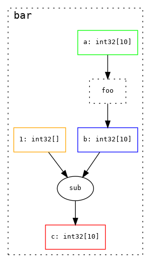
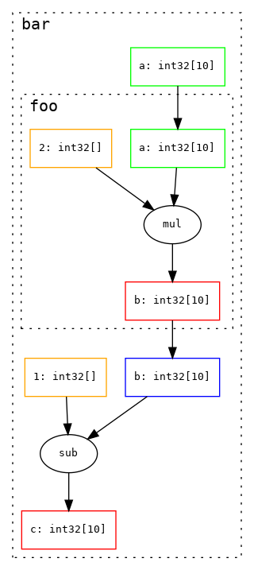
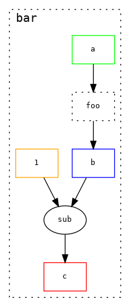

# Jaxpr-Viz

JAX Computation Graph Visualisation Tool

JAX has built-in functionality to visualise the
HLO graph generated by JAX, but I've found this rather
low-level for some use-cases.

The intention of this package is to visualise how
sub-functions are connected in JAX programs. It does
this by converting the [JaxPr](https://jax.readthedocs.io/en/latest/jaxpr.html)
representation into a pydot graph.

> **NOTE:** This project is still at an early stage and may not
> support all JAX functionality (or permutations thereof). If you spot
> some strange behaviour please create a [Github issue](https://github.com/zombie-einstein/jaxpr-viz/issues).

## Installation

Install with pip:

```bash
pip install jpviz
```

Dependent on your system you may also need to install [Graphviz](https://www.graphviz.org/)

## Usage

Jaxpr-viz can be used to visualise jit compiled (and nested)
functions, for example with the functions

```python
import jax
import jax.numpy as jnp

@jax.jit
def foo(x):
    return 2 * x

@jax.jit
def bar(x):
    x = foo(x)
    return x - 1
```

jaxpr-viz wraps functions, which can then be called
with concrete arguments

```python
import jpviz

jpviz.draw(bar)(jnp.arange(10))
```

produces



> **NOTE:** For sub-functions to show as nodes/sub-graphs they
> need to be marked with `@jax.jit`

### Visualisation Options

#### Collapse Nodes
By default, functions that are composed of only primitive functions
are collapsed into a single node (like `foo` in the above example).
The full computation graph can be rendered using the `collapse_primitives`
flag

```python
import jpviz

jpviz.draw(bar, collapse_primitives=True)(jnp.arange(10))
```

produces



#### Show Types

By default, type information is included in the node labels, this
can be hidden using the `show_avals` flag

```python
import jpviz

jpviz.draw(bar, show_avals=False)(jnp.arange(10))
```

produces



#### Jupyter Notebook

To show the rendered graph in a jupyter notebook you can use the
helper function `view_pydot`

```python
dot = jpviz.draw(bar, collapse_primitives=True)(jnp.arange(10))
jpviz.view_pydot(dot)
```

## Developers

Dependencies can be installed with [poetry](https://python-poetry.org/) by running

```bash
poetry install
```

### Pre-Commit Hooks

Pre commit hooks can be installed by running

```bash
pre-commit install
```

Pre-commit checks can then be run using

```bash
task lint
```

### Tests

Tests can be run with

```bash
task test
```
